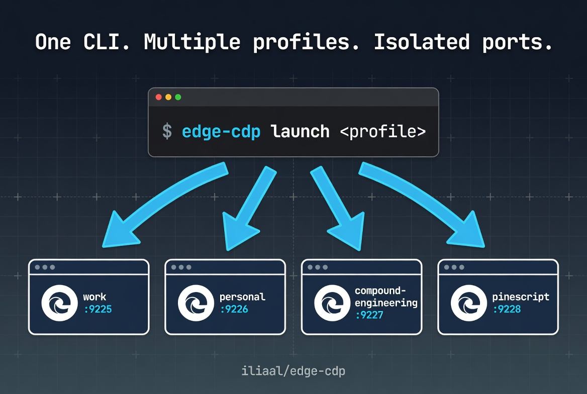

# edge-cdp

[](LICENSE)
[](https://www.python.org/)
[](#)
[](https://x.com/intent/follow?screen_name=iliaa)



Unified launcher and Playwright CDP helper for Microsoft Edge (and Chrome). Manages multiple named profiles, each on its own debug port and user-data directory. Replaces ad-hoc per-repo `launch-edge.sh` scripts when several tools need an authenticated browser session for automation or PDF capture.

Designed primarily for WSL (Windows-side Edge driven from a Linux shell). Works on native Linux and macOS too.

## 🚀 Quick Start

```bash
git clone https://github.com/iliaal/edge-cdp
cd edge-cdp
uv sync
uv tool install --editable .
python3 -m pip install --user -e .   # so the system python3 can import edge_cdp
```

`edge-cdp` lands in `~/.local/bin`. First run copies `profiles.example.toml` to `~/.config/edge-cdp/profiles.toml`. Edit that file (or use `edge-cdp profile add`) to set up your real profiles.

```bash
edge-cdp launch work                                  # spawn the 'work' profile
edge-cdp pdf work https://example.com report.pdf      # capture a page as PDF
edge-cdp profile list                                 # show configured profiles
```

## 🔗 Used by

[whetstone](https://github.com/iliaal/whetstone)'s `scripts/post-thread.py` drives the X compose box over CDP using the `compound-engineering` profile on port 9225. Same shape works for any browser automation that needs a persistent, authenticated session without re-logging-in.

## 🛠️ CLI

```
edge-cdp status                              # list profiles, show alive/dead per port
edge-cdp launch <profile>                    # spawn if dead, no-op if alive
edge-cdp ensure <profile>                    # alias for launch (script-friendly)
edge-cdp shell <profile> -- CMD ARGS...      # run CMD with CDP_URL + EDGE_PROFILE in env
edge-cdp profile list
edge-cdp profile add NAME [--port N] [--data-dir PATH] [--browser edge|chrome] [--purpose TEXT] [--bind-all]
edge-cdp profile remove NAME
edge-cdp pdf <profile> URL OUT [--tall] [--viewport WxH] [--wait SECS] [--media screen|print] [--stamp [top|bottom]]
```

`profile add` auto-picks the next free CDP port starting at 9225 and defaults the data directory to `C:\Users\<wsl-user>\edge-<name>` on WSL (override with `--data-dir`, or set `WIN_USER` in the environment if your Windows username differs from your WSL `$USER`).

## 📚 Library

```python
from edge_cdp import ensure_running, connect, capture_pdf

ensure_running("work")
pw, browser, context, page = connect("work")

capture_pdf(
    profile="work",
    url="https://example.com/some-page",
    out="page.pdf",
    viewport=(1280, 900),
    wait_seconds=2,
)
```

PDF defaults: `emulate_media("screen")`, `print_background=True`, A4, 10mm margins. Pass `tall=True` for a single-page render at `body.scrollHeight` (useful for archival captures where pagination breaks layouts).

Pass `stamp="bottom"` or `stamp="top"` (CLI: `--stamp bottom` / `--stamp top`; bare `--stamp` defaults to bottom) to add a header or footer with the captured URL, UTC retrieval timestamp, and page numbers. The matching margin is bumped to 18mm to fit; in tall mode the height is padded so content doesn't clip.

## ✨ Multiple profiles in parallel

Different profiles on different ports run simultaneously. Edge spawns a separate process per `--user-data-dir`, so `edge-cdp ensure work` and `edge-cdp ensure personal` can both run without conflict.

The "close all Edge windows" warning sometimes seen in older recipes only applies when something else is already using the *same* user-data-dir as a profile you are trying to launch.

## 🔒 Security: localhost binding by default

The CDP debug port is bound to `127.0.0.1` by default, so only processes on the same machine can connect. This matters because anyone who reaches the port has full control of the browser, including reading every cookie and session for every domain you are logged into.

If you genuinely need LAN access (e.g., driving the browser from a different host), opt in per profile:

```bash
edge-cdp profile add lan-accessible --bind-all
```

Or edit `~/.config/edge-cdp/profiles.toml` and add `bind_all = true` under the profile section. Existing profiles default to localhost-only on next launch.

## 📄 Why screen-media + background-graphics defaults

Browsers default to print CSS when rendering to PDF, including via CDP `Page.printToPDF`. Many sites' `@media print` rules collapse multi-column layouts and turn icon fonts into glyph boxes. `emulate_media("screen")` prevents that. `print_background=True` preserves background colors and images, which dashboard-style pages rely on. `capture_pdf` bakes both in so you don't have to remember.

Override with `media="print"` if you actually want the print stylesheet.

## License

MIT. See [LICENSE](LICENSE).

---

[Follow @iliaa on X](https://x.com/iliaa) • [Blog](https://ilia.ws) • If this killed your launch-edge.sh hack, ⭐ star it!
